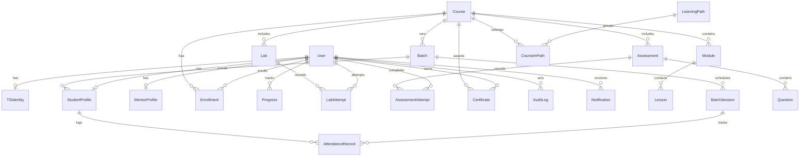

# Thread Security Education (TSE LMS) — Project Knowledge Base & System Architecture

**Project Name:** Thread Security Education LMS (TSE LMS)  
**Workspace:** `threads-edu`  
**Repository Version:** 1.0.0 (Production Architecture)  
**Primary Domain:** Cybersecurity Education, Penetration Testing & SOC Workforce Training  
**Last Updated:** August 2026

---

## 1. Executive Summary & Purpose

**Thread Security Education (TSE LMS)** is an enterprise-grade, SSR-first Learning Management System engineered specifically for cybersecurity training, offensive/defensive security certifications, hands-on vulnerability labs, and cohort-based batch learning.

The platform bridges theoretical infosec education and real-world practical offensive/defensive operations by integrating:
1. **Interactive Curriculum Delivery:** Multi-module video and technical document walkthroughs.
2. **Practical Lab Sandboxes:** Virtualized targets with dynamic flag verification (`TSE{...}`).
3. **Automated Assessment & Examination Engines:** Server-validated technical exams with instant feedback.
4. **Cohort & Batch Management:** Scheduled sessions, attendance logging, and mentor allocations.
5. **Cryptographically Verified Certificates:** Tamper-proof certificate issuance with SHA-256 validation hashes.
6. **Enterprise Security & Auditability:** 6-tier Role-Based Access Control (RBAC), Multi-Factor Authentication (MFA/OTP), IP rate-limiting, and comprehensive SOC-style audit logging.

---

## 2. Technology Stack & Technical Specifications

| Layer | Technology | Purpose & Details |
| :--- | :--- | :--- |
| **Framework** | **Next.js 15+ App Router** | SSR-first architecture, Server Components by default, Server Actions for mutations |
| **Runtime / Language** | **TypeScript 5.7+ / Node.js 22+** | Strict type safety across client, server, and database layers |
| **Styling & UI** | **Tailwind CSS + Radix UI + Framer Motion** | Custom cybersecurity design system, controlled glassmorphism, responsive tokens |
| **Database & ORM** | **PostgreSQL + Prisma ORM 6.3+** | Relational integrity, foreign key constraints, connection pooling, migrations |
| **Authentication & RBAC**| **Custom NextAuth / Auth.js + Crypto Vault** | Session tokens, PBKDF2 / Argon2 hashing, 6-tier hierarchical roles, OTP verification |
| **Mailing / Notifications**| **Nodemailer + Custom SMTP Transport** | Automated OTP verification emails, enrollment alerts, attendance notifications |
| **Validation** | **Zod v3.24+** | Runtime schema validation on API payloads, form submissions, and server actions |
| **State Management** | **Zustand v5.0+ / URL Search Params** | Ephemeral client UI state (sidebar collapse, search filters, modals) |
| **Testing** | **Vitest 3.0+** | Unit, integration, and security logic testing suites |

---

## 3. Architecture & Directory Blueprint

```
threads-edu/
├── app/                                # Next.js 15 App Router Layer
│   ├── (admin)/admin/                  # Admin portal (Courses, Batches, Mentors, DB Sync, Audit, SOC)
│   ├── (auth)/login/ | register/       # Authentication, MFA Verification & Lockout handling
│   ├── (mentor)/mentor/                # Mentor portal (Cohorts, Attendance, Student Submissions)
│   ├── (public)/                       # Public landing, Course directory, Certificate verification
│   │   ├── courses/                    # Public course catalog & previews
│   │   ├── learning-paths/             # Career track roadmap & syllabi
│   │   └── verify-certificate/[id]/    # Public cryptographic certificate validator
│   ├── (student)/student/              # Student LMS dashboard
│   │   ├── courses/[courseId]/learn/   # Lesson player (Video, Docs, Integrated Lab launcher)
│   │   ├── labs/[labId]/               # Sandbox instructions & Flag submission terminal
│   │   ├── assessments/[assessmentId]/ # Timed qualification exams & auto-grading
│   │   ├── attendance/                 # Batch attendance records & streak tracking
│   │   ├── certificates/               # Issued credentials & download triggers
│   │   └── report/                     # Student academic performance transcript
│   ├── api/health/                     # Health check & system status endpoints
│   ├── globals.css                     # Global styles & design token bindings
│   └── layout.tsx                      # Root layout (Josefin Sans font, Navbar, Notifications)
├── prisma/
│   ├── schema.prisma                   # Full PostgreSQL database schema (20+ models)
│   └── seed.ts                         # Production-grade seed data (Admins, Mentors, Courses, Labs)
├── src/
│   ├── components/                     # Reusable UI component library
│   │   ├── navigation/                 # Role-aware navigation bars and sidebars
│   │   ├── notifications/              # Real-time alert bell & toast notifications
│   │   └── ui/                         # Radix UI primitives (Button, Card, Badge, Modal, Tabs)
│   ├── features/                       # Domain feature modules & Server Actions
│   │   ├── admin/actions/              # Admin CRUD actions (Batches, Users, DB synchronization)
│   │   ├── auth/actions/               # Login, Registration, OTP, Password Reset actions
│   │   ├── batch/actions/              # Cohort creation, session scheduling & attendance marking
│   │   ├── mentor/actions/             # Mentor grading & feedback actions
│   │   └── notifications/actions/      # Notification dispatch and mark-as-read actions
│   ├── lib/
│   │   ├── auth/                       # Session handling, TS-ID generation (`TSE-YYYY-XXXXXX`)
│   │   ├── security/                   # Crypto vault, password hashing, IP rate limiter & guard
│   │   └── utils.ts                    # Class merging (`clsx`, `tailwind-merge`)
│   ├── server/
│   │   ├── database/prisma.ts          # Singleton Prisma client instance
│   │   ├── email/mailer.ts             # SMTP transporter & transactional email templates
│   │   ├── security/audit.ts           # Centralized audit logger with actor attribution
│   │   └── services/                   # Business logic layer
│   │       ├── admin.service.ts        # User approvals, batch allocation, system metric calculations
│   │       ├── auth.service.ts         # Authentication, OTP generation/validation, security lockout
│   │       ├── batch.service.ts        # Cohort sessions, attendance processing, streak algorithms
│   │       ├── mentor.service.ts       # Mentee metrics and submission reviews
│   │       ├── notification.service.ts # System alerts & in-app notifications
│   │       └── security-analyst.service.ts # Daily/Weekly/Monthly log synthesis & SOC reports
│   └── styles/tokens.css               # Design system variables (Cyber Green, Deep Navy, Glass UI)
└── docs/
    └── architecture/                   # Architectural audits and RFCs
```

---

## 4. Database Schema & Data Model



### Key Models & Descriptions
1. **`User` & `TSIdentity`**: Core user entity linked to an immutable TS-ID (e.g. `TSE-2026-999`). Supports 6-tier RBAC (`STUDENT`, `MENTOR`, `CONTENT_MANAGER`, `ACADEMIC_ADMIN`, `SECURITY_ADMIN`, `SUPER_ADMIN`).
2. **`StudentProfile` & `MentorProfile`**: Extended domain profiles storing bio, career goals, hours learned, attendance streaks, and mentor associations.
3. **`Course`, `Module`, `Lesson`**: Hierarchical curriculum structure supporting video streams, technical documentation, preview gating, and ordering.
4. **`Lab` & `LabAttempt`**: Hands-on offensive/defensive sandboxes with flag verification (`flagHash`), objectives, estimated duration, and score recording.
5. **`Assessment`, `Question`, `AssessmentAttempt`**: Rigorous examinations supporting MCQ, Multi-Select, True/False, and Short Answer with automatic score calculation and feedback.
6. **`Batch`, `BatchSession`, `AttendanceRecord`**: Live cohort scheduling, session agendas, and real-time attendance marking (`PRESENT`, `ABSENT`, `LATE`, `EXCUSED`).
7. **`Certificate`**: Cryptographically verifiable credentials (`CERT-YYYY-XXXXX`) with unique verification hashes verifiable on `/verify-certificate/[id]`.
8. **`AuditLog` & `SystemLog`**: Security compliance logging recording all critical user and system events with IP addresses and actor metadata.

---

## 5. Security & Academic Integrity Model

1. **Server-Side Authority (Zero Client Trust):**
   - Progress calculations, lab flag checks, and exam scoring occur exclusively in server-side transactions. Client score submissions are strictly rejected.
2. **Cryptographic Identity & Anti-Tampering:**
   - Every student is assigned a unique `TSIdentity`.
   - Certificates store SHA-256 hashes generated from the user's TS-ID, course completion timestamp, and secret salt.
3. **Brute-Force & Credential Stuffing Defense:**
   - `SecurityLockout` tracks failed login and OTP attempts.
   - Accounts lock automatically after 5 failed attempts with exponential backoff.
4. **Comprehensive SOC Audit Trail:**
   - All role modifications, database syncs, certificate issuances, and lab completions generate immutable `AuditLog` and `SystemLog` entries.

---

## 6. Core User Workflows

### Student Learning Journey
1. **Onboarding & Approval:** User registers $\rightarrow$ Super Admin grants dashboard access $\rightarrow$ Student assigned unique TS-ID.
2. **Curriculum & Labs:** Student streams lessons $\rightarrow$ launches hands-on lab sandboxes $\rightarrow$ submits flags $\rightarrow$ receives instant feedback.
3. **Cohort Attendance:** Attends live sessions $\rightarrow$ Mentor logs attendance $\rightarrow$ Student tracks attendance percentage and streak.
4. **Assessment & Certification:** Completes modular quizzes and final qualification exam ($>75\%$) $\rightarrow$ system automatically issues verified certificate.

### Mentor Workflow
1. **Cohort Oversight:** View assigned batch student lists and individual attendance records.
2. **Live Session Management:** Take daily attendance, log session notes, and monitor student lab submission queues.
3. **Feedback & Mentorship:** Provide technical feedback on assessment attempts and lab blockers.

### Admin & Security Operations
1. **Curriculum Authoring:** Create and publish courses, modules, lessons, labs, and question banks.
2. **Batch & User Administration:** Approve pending registrations, schedule batch cohorts, and assign mentors.
3. **SOC & Log Monitoring:** Inspect daily, weekly, and monthly system health and authentication logs via `security-analyst.service.ts`.
